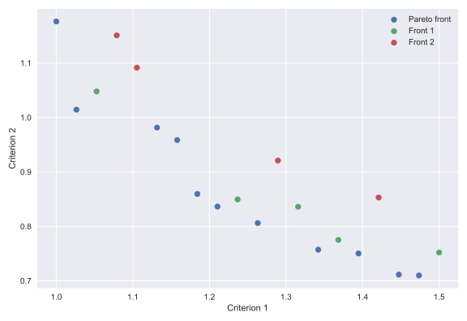

# Non-dominated sorting


## Description of the method

You can read about the method in the next article:

[Buzdalov M., Shalyto A. A Provably Asymptotically Fast Version of the Generalized Jensen Algorithm for Non-dominated Sorting  // Parallel Problem Solving from Nature XIII.- 2015. - P. 528-537. - (Lecture Notes on Computer Science; 8672)](https://www.semanticscholar.org/paper/A-Provably-Asymptotically-Fast-Version-of-the-for-Buzdalov-Shalyto/76322e33a6722a80c121a5f515ed3a9897e97eb3)

## Requirements

1. Python 3.6 or higher.
2. Installed [setuptools](https://pypi.org/project/setuptools/).
3. Installed [wheel](https://pythonwheels.com/).

## Installation

### PyPI

[](https://badge.fury.io/py/nds)

### Local installation 

Run `pip install .`.

## Tests

Run command:
```
python -m unittest discover -v ./tests
```

## How to use

The example:

```python
import random

# Package must be installed.
from nds import ndomsort

seq = [random.sample(range(-10, 11), 5) for i in range(30)]

# It is dictionary.
fronts = ndomsort.non_domin_sort(seq)

# Or we can get values of objectives.
# fronts = ndomsort.non_domin_sort(seq, lambda x: x[:4])

# 'fronts' is a tuple of front's indices, not a dictionary.
# fronts = ndomsort.non_domin_sort(seq, only_front_indices=True)

for front in fronts:
    print("\nFront index is {}".format(front))
    for seq in fronts[front]:
        print("\t{}".format(seq))

```

## Other implementations

* [Java (Jensen-Fortin-Buzdalov divide-and-conquer method)](https://github.com/mbuzdalov/non-dominated-sorting)
* [C#](https://github.com/KernelA/nds)

## Example



